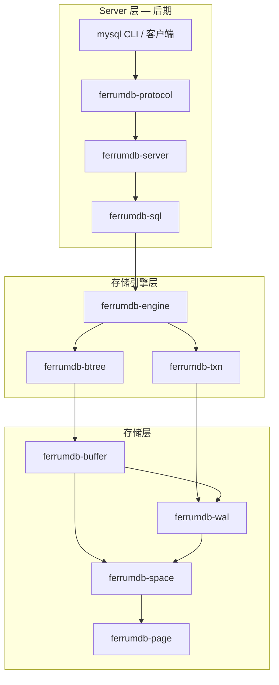
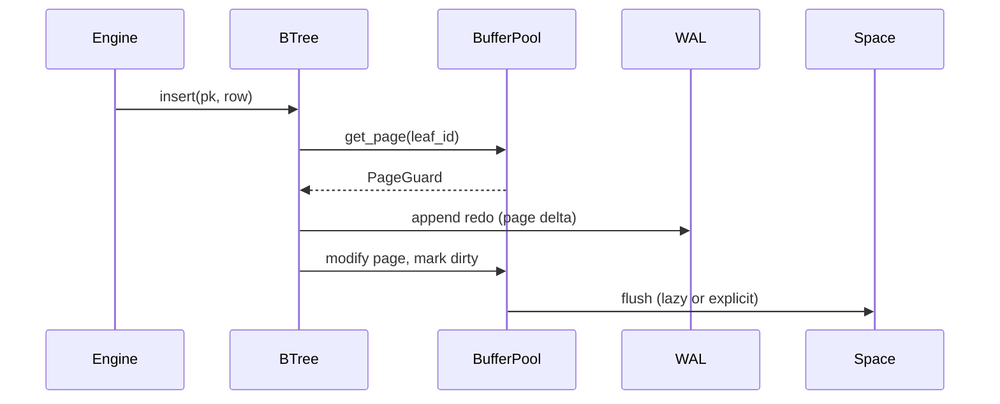
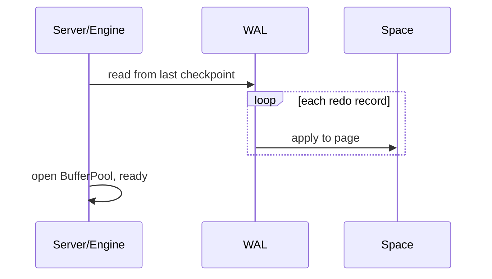

# FerrumDB 架构

## 系统分层



**依赖方向**：上层依赖下层，下层不依赖上层。`ferrumdb-page` 无内部依赖，是最底层。

---

## Crate 职责

| Crate | 职责 | 主要类型（规划） |
|-------|------|------------------|
| `ferrumdb-page` | 16KB 页、页头、行编解码、Slotted Page | `Page`, `PageHeader`, `Row`, `Schema` |
| `ferrumdb-btree` | B+Tree 节点、插入/分裂/扫描；内存与持久化 | `BTree`, `Node`, `PageId` |
| `ferrumdb-buffer` | Buffer Pool、frame、pin、LRU、脏页 flush | `BufferPool`, `PageGuard` |
| `ferrumdb-wal` | Redo log append、replay、checkpoint | `Wal`, `RedoRecord`, `Lsn` |
| `ferrumdb-space` | 表空间文件、superblock、页分配 | `Space`, `Superblock` |
| `ferrumdb-txn` | 事务、Undo、ReadView、MVCC | `Transaction`, `UndoRecord`, `ReadView` |
| `ferrumdb-engine` | `StorageEngine` trait 与默认实现 | `FerrumEngine`, `TableCatalog` |
| `ferrumdb-protocol` | MySQL Wire Protocol 编解码 | `Packet`, `Handshake` |
| `ferrumdb-sql` | SQL 解析、简单执行计划 | `Parser`, `Statement` |
| `ferrumdb-server` | TCP 监听、连接会话 | `Server`, `Session` |

---

## 磁盘布局（规划）

```text
tablespace.ibd
├── Page 0      Superblock（magic, version, page_size, free_list_head, ...）
├── Page 1      系统/catalog（表元数据，后期）
├── Page 2..N   B+Tree 节点页（聚簇 + 二级索引）
└── ...         数据与索引混合分配（InnoDB 类似）
```

**单页布局（16KB）**

```text
+------------------+
| Page Header      |  固定长度，含 page_id, type, lsn, checksum
+------------------+
| User Records     |  Slotted page 或 B+Tree 节点序列化数据
| ...              |
+------------------+
| Slot Directory   |  从页尾向前增长（Slotted Page）
+------------------+
| Page Footer      |  可选，如 duplicate checksum
+------------------+
```

---

## 关键数据流

### 插入一行（阶段 7 后）



### 崩溃恢复（阶段 5 后）



---

## StorageEngine 接口（规划）

引擎层对外暴露的能力，供 SQL 层或测试直接调用：

```rust
// 仅规划签名，实现在 ferrumdb-engine

pub trait StorageEngine {
    fn create_table(&mut self, name: &str, schema: Schema) -> Result<()>;
    fn drop_table(&mut self, name: &str) -> Result<()>;

    fn insert(&mut self, table: &str, row: Row) -> Result<()>;
    fn update(&mut self, table: &str, pk: Value, row: Row) -> Result<()>;
    fn delete(&mut self, table: &str, pk: Value) -> Result<()>;

    fn get_by_pk(&self, table: &str, pk: Value) -> Result<Option<Row>>;
    fn scan(&self, table: &str, range: RangeBound) -> Result<RowIterator>;

    fn begin(&mut self) -> Result<TransactionId>;
    fn commit(&mut self, tx: TransactionId) -> Result<()>;
    fn rollback(&mut self, tx: TransactionId) -> Result<()>;
}
```

事务相关方法在阶段 9 之前可返回 `Unsupported` 或内部 no-op 单语句自动提交。

---

## 与 InnoDB 的对照

| InnoDB 概念 | FerrumDB 对应 | 阶段 |
|-------------|---------------|------|
| 16KB Page | `ferrumdb-page::Page` | 1 |
| Tablespace (.ibd) | `ferrumdb-space::Space` | 3 |
| Buffer Pool | `ferrumdb-buffer::BufferPool` | 4 |
| Redo Log | `ferrumdb-wal::Wal` | 5 |
| Clustered Index | 主键 B+Tree 叶存整行 | 2–3 |
| Secondary Index | 叶存 (index_col, pk) | 6 |
| Undo Log | `ferrumdb-txn` | 9 |
| Read View / MVCC | `ferrumdb-txn::ReadView` | 10 |
| Handler API | `StorageEngine` trait | 7 |

---

## 技术约定

1. **字节序**：Little-endian，全项目统一。
2. **页大小**：常量 `16384`，不在运行时配置（第一版）。
3. **错误处理**：库 crate 用 `thiserror`；binary/server 可用 `anyhow`。
4. **并发**：阶段 4 前单线程；之后 Buffer Pool 用 `Mutex`/`RwLock`，逐步细化。
5. **I/O**：`std::fs` 起步；Server 层用 `tokio`。
6. **日志**：`tracing`，不用 `println!` 做诊断。

---

## 测试策略

| 层级 | 方式 |
|------|------|
| page / btree | 单元测试，内存 |
| space / wal | 临时文件，`tempfile` crate |
| buffer | mock Space 计数 I/O |
| engine | 集成测试：create → insert → reopen → verify |
| server | 可选：TCP loopback 或 mysql CLI 手工 |

---

## 变更记录

| 日期 | 说明 |
|------|------|
| 2025-06-27 | 初版架构文档 |
